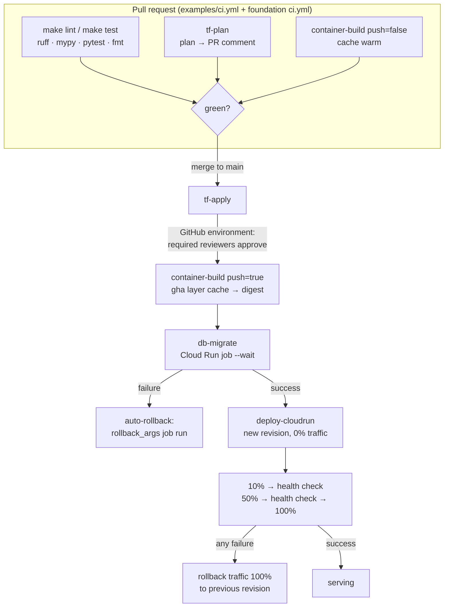

# gcp-cicd-workflows

Reusable GitHub Actions workflows for deploying to GCP — keyless (OIDC), cached, canary,
multi-environment. **Referenced, never copied**: callers use
`uses: Yukihide-Mitsuoka/gcp-cicd-workflows/.github/workflows/<name>.yml@vN` with the
reviewed floating major documented for that workflow, exactly like
[terraform-gcp-modules](https://github.com/Yukihide-Mitsuoka/terraform-gcp-modules) does
for infrastructure building blocks.

## Position in the ecosystem

| Repo | Model | Provides |
|------|-------|----------|
| [ai-dev-foundation](https://github.com/Yukihide-Mitsuoka/ai-dev-foundation) | copy (template) | Rules, skills, hooks, stack-agnostic CI (`make lint/test/build`) |
| [terraform-gcp-template](https://github.com/Yukihide-Mitsuoka/terraform-gcp-template) | copy (template) | Terraform project skeleton (`infra/envs/`) |
| [terraform-gcp-modules](https://github.com/Yukihide-Mitsuoka/terraform-gcp-modules) | reference (`?ref=vX.Y.Z`) | Terraform building blocks incl. **github-oidc** (the auth this repo consumes) |
| **this repo** | reference (`@vN`) | The deploy pipeline itself |

Style/test gates are NOT here — the foundation's `ci.yml` (`make lint`, `make test`,
ruff/mypy/pytest via the python-uv profile) already owns them. These workflows cover only
what needs cloud credentials or deploy orchestration.

## Pipeline control flow



## Workflows

| Workflow | Trigger side | Does |
|----------|--------------|------|
| [tf-plan.yml](.github/workflows/tf-plan.yml) | PR | OIDC auth → init/validate/plan → collapsed PR comment, updated in place |
| [tf-apply.yml](.github/workflows/tf-apply.yml) | merge | Apply gated by a GitHub **environment** (required reviewers = manual approval) |
| [container-build.yml](.github/workflows/container-build.yml) | PR (no push) / merge (push) | buildx + `type=gha` layer cache → Artifact Registry; outputs the **digest-pinned** image ref |
| [deploy-cloudrun.yml](.github/workflows/deploy-cloudrun.yml) | merge | Canary: 0% revision → 10→50→100 with health checks; auto traffic rollback on failure |
| [db-migrate.yml](.github/workflows/db-migrate.yml) | merge | Migration as a Cloud Run job (`--wait`); auto-runs `rollback_args` on failure |
| [bq-cost-gate.yml](.github/workflows/bq-cost-gate.yml) | PR | Runs caller compilation without credentials, transfers only contained regular SQL files, then authenticates in a separate job for BigQuery dry runs. Fails when estimated bytes exceed reviewed budgets |
| [bq-inspect.yml](.github/workflows/bq-inspect.yml) | on-demand / schedule | Runs the caller's read-only FR-4 inspection engine (11 deterministic governance checkpoints) with the **inspector SA**; appends `summary.md` to the job summary and uploads `findings.json` + `summary.md` + deterministic `remediation-draft.md` as an artifact. Report-only by default; opt-in `fail_on` gates CI |

`bq-cost-gate` callers MUST use `@v2`. Its `compile_command` is intentionally
credential-free; use a dedicated `COST_GATE_SA` for the fixed dry-run job and never pass
`DEPLOYER_SA`. Point it at a checked-in target such as `make compile-cost-gate`; install
locked tooling before the workflow command rather than downloading packages inline. See
[ADR-0001](docs/adr/0001-isolate-cost-gate-compilation-from-wif.md).

Worked callers: [examples/ci.yml](examples/ci.yml), [examples/cd.yml](examples/cd.yml),
[examples/bq-cost-gate-caller.yml](examples/bq-cost-gate-caller.yml),
[examples/bq-inspect-caller.yml](examples/bq-inspect-caller.yml).

## Setup (once per consumer repo)

1. Provision auth with the terraform module and record its outputs:
   ```hcl
   module "github_oidc" {
     source            = "git::https://github.com/Yukihide-Mitsuoka/terraform-gcp-modules.git//modules/github-oidc?ref=v0.2.0"
     project_id        = var.project_id
     github_repository = "you/your-app"
     roles             = ["roles/run.admin", "roles/artifactregistry.writer", "roles/iam.serviceAccountUser"]
   }
   ```
2. Set repo **variables** `WIF_PROVIDER` / `DEPLOYER_SA` from the module outputs (they are
   identifiers, not secrets). For `bq-inspect` also set `INSPECTOR_SA` — a **separate**
   read-only SA (FR-6), never the deployer. For `bq-cost-gate`, set `COST_GATE_SA` to a
   dedicated least-privilege dry-run identity; never reuse `DEPLOYER_SA`.
3. Create the GitHub **environment** (e.g. `production`) with Required reviewers — that is
   the tf-apply approval gate.
4. Copy the relevant example callers and adjust their inputs. Caller jobs must grant
   `permissions: id-token: write` (plus `pull-requests: write` for the plan comment).

## Versioning (floating majors)

GitHub-standard convention: consumers pin a reviewed floating major and receive only
backward-compatible updates within it. Exact tags also exist. `bq-cost-gate` uses `@v2`
because ADR-0001 deliberately removed credentialed caller compilation; its v1 contract
must not be used for new callers. Other workflows remain compatible at `@v1`. This differs
deliberately from the terraform library's exact-pin style (`?ref=v0.2.0`).

## Troubleshooting

Error-pattern playbook for AI (and human) operators:
[docs/troubleshooting.md](docs/troubleshooting.md).

## License

MIT — see [LICENSE](LICENSE).
